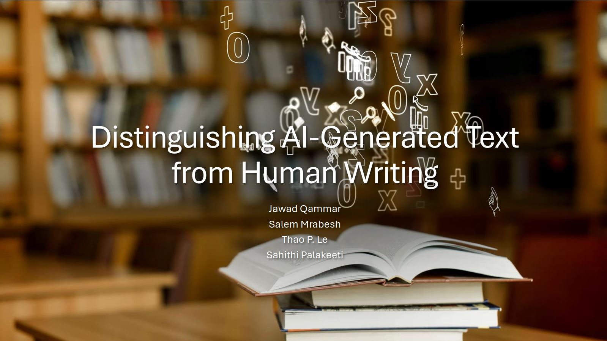

# Distinguishing-AI-Generated-Text-from-Human-Writing

## Repository Link

[https://github.com/JawwadQammar/Distinguishing-AI-Generated-Text-from-Human-Writing]

## Description

In the rapidly evolving landscape of artificial intelligence (AI), the generation of text by AI systems has become increasingly sophisticated, leading to more significant advancements in natural language processing (NLP) and its related technologies. Nowadays AI generated text produced by transformers such GPT is very similar to human text, making it very hard to differentiate between the two texts. This seemingly human text is making it very difficult for the academic community to detect plagiarism and the journalism community to stop the spread of misinformation.
The motivation for this project stems from the need to successfully look for options and characteristics which can help in differentiating human text from AI text. 
This understanding is crucial for various applications, including detecting AI-generated misinformation, preserving the integrity of human-authored content, and enhancing the transparency of AI-driven tools.
By looking at division of characters, statistical methods and machine learning models this project aims to uncover the subtle differences which will aid in differentiating the two texts.
The detection of AI authored text is pivotal for many industries such as journalism, education, and digital communication.

### Task Type

Classification/ Text Classification

### Results Summary

- **Best Model:** Logistic Regression
- **Evaluation Metric:** Accuracy, MSE
- **Result:** 98% accuracy

## Documentation

1. **[Literature Review](0_LiteratureReview/README.md)**
2. **[Dataset Characteristics](1_DatasetCharacteristics/exploratory_data_analysis.ipynb)**
3. **[Baseline Model](2_BaselineModel/baseline_model.ipynb)**
4. **[Model Definition and Evaluation](3_Model/model_definition_evaluation)**
5. **[Presentation](4_Presentation/README.md)**

## Cover Image

